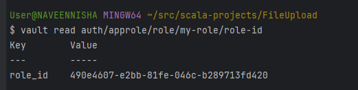

let us do test driven delvelopment. This is scala application. There is a fileupload api to aws s3 is created using fastapi in python. We need to create an application which calls this endpoint and upload the file. The catch is we need to call Identity provider with Client cert where client cert stored in valut we need to fetch from valut and call IDP get the token and make a call to an endpoint. And this application should have configuration for each environment lets say dev, test, staging, prod. This is the standard egress pattern for the enterprise which will be used by any team either yaml based config or import this application and use it for their use case. Lets build one module at a time and test then we proceed. Ask me question if you don't fully understand the requirement

o create this application following a test-driven development (TDD) approach, we need to break down the requirements and implement them step by step. Here's an outline of the tasks we'll undertake:

Fetch Client Certificate from Vault: Create a Scala module that fetches the client certificate from a secure vault.
Authenticate with Identity Provider (IDP): Use the fetched certificate to authenticate with an IDP and retrieve a token.
Call the File Upload API: Use the token to call the FastAPI endpoint and upload a file to AWS S3.
Configuration Management: Implement configuration management for different environments (dev, test, staging, prod) using YAML files.
Module Testing: Test each module independently before integration.


Vault Setup:

Install Vault CLI using choco

choco install vault


Powershell (with admin access):

$env:VAULT_ADDR = "http://127.0.0.1:8200"

$env:VAULT_TOKEN = "root"

Enable Approle

vault auth enable approle

create policy

```
vault  policy  write bbu-apps-ro -<<EOF
path "secret/data/dev/bbu/fileupload-secrets" {
capabilities = ["read"]
}
EOF
```


create role

```

vault write auth/approle/role/my-role   \
secret_id_ttl=365d     token_num_uses=10     token_ttl=20m   \
token_max_ttl=30m     secret_id_num_uses=40 \
token_policies="bbu-apps-ro"
```


get role id
```
vault read auth/approle/role/my-role/role-id
```




get secret id
vault write -f auth/approle/role/my-role/secret-id

Login using role_id and secret_id

```
vault write auth/approle/login role_id="490e4607-e2bb-81fe-046c-b289713fd420" secret_id="76cc9abd-50ba-9cec-18bf-96e4d50415a1"
```


Verify whether you are able to access the secret

```
curl --header "X-Vault-Token: hvs.CAESII9JNn5__yzp8pF0soSkwuDZmfHki3zrxSSWBqXTQz-RGh4KHGh2cy5FZVBJWGtUS09lNU5LOUpqd0RxZzJqVVY" http://127.0.0.1:8200/v1/secret/dev/bbu/fileupload-secrets
```


Export token
$env:VAULT_TOKEN="hvs.CAESIJQmAnEtvNHqcYWLoxO_pJ3njF4VSSamScjrmS6IedFKGh4KHGh2cy4xZkVpMnNCbjRDajRPWVhGSU1zVFVTNnU"

Do a lookup to validate

vault token lookup


```
curl --header "X-Vault-Token: hvs.CAESII9JNn5__yzp8pF0soSkwuDZmfHki3zrxSSWBqXTQz-RGh4KHGh2cy5FZVBJWGtUS09lNU5LOUpqd0RxZzJqVVY" http://127.0.0.1:8200/v1/secret/dev/bbu/fileupload-secrets
```


